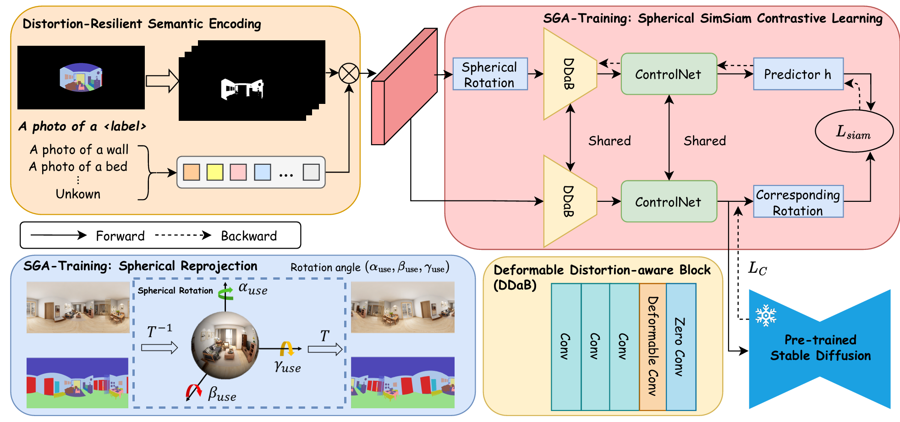

<div align="center">

# ✨SphereDiffusion✨
<p><b>SphereDiffusion: Spherical Geometry-Aware Distortion Resilient Diffusion Model</b>.</p>

<!-- </img> -->

<a href='https://arxiv.org/abs/2403.10044'></a> &nbsp;
[](https://huggingface.co/SugerWu/SphereDiffusion/tree/main)

Official implementation of [SphereDiffusion: Spherical Geometry-Aware Distortion Resilient Diffusion Model](https://arxiv.org/abs/2403.10044).
</div>

## 🥳 Pipline


## 🔆 Abstract

> Controllable spherical panoramic image generation holds substantial applicative potential across a variety of domains. However, it remains a challenging task due to the inherent spherical distortion and geometry characteristics, resulting in low-quality content generation. In this paper, we introduce a novel framework of SphereDiffusion to address these unique challenges, for better generating high-quality and precisely controllable spherical panoramic images. For the spherical distortion characteristic, we embed the semantics of the distorted object with text encoding, then explicitly construct the relationship with text-object correspondence to better use the pre-trained knowledge of the planar images. Meanwhile, we employ a deformable technique to mitigate the semantic deviation in latent space caused by spherical distortion. For the spherical geometry characteristic, in virtue of spherical rotation invariance, we improve the data diversity and optimization objectives in the training process, enabling the model to better learn the spherical geometry characteristic. Furthermore, we enhance the denoising process of the diffusion model, enabling it to effectively use the learned geometric characteristic to ensure the boundary continuity of the generated images. With these specific techniques, experiments on Structured3D dataset show that SphereDiffusion significantly improves the quality of controllable spherical image generation and relatively reduces around 35\% FID on average.

## 📦 Installation

```bash
# using pip
pip install -r requirements.txt

# using conda
conda env create -f environment.yml
```

## 🛠️ Preparation
### Prepare pretrained SD1.5 model
You can download it from the [official page of Stability](https://huggingface.co/runwayml/stable-diffusion-v1-5/tree/main). You want the file ["v1-5-pruned.ckpt"](https://huggingface.co/runwayml/stable-diffusion-v1-5/tree/main). Besides, you the file ["v1-5-pruned.ckpt"](https://huggingface.co/SugerWu/SphereDiffusion/tree/main) from our repo. and put this file in the folder "models".

### Prepare pretrained Sphere model
You can download it from the [official repo of SphereDiffusion](https://huggingface.co/SugerWu/SphereDiffusion/tree/main).
```bash
mdir pretrain_model
cd pretrain_model
git clone https://huggingface.co/SugerWu/SphereDiffusion
```

## 📷 Inference 
### Generate images
```bash
# inference single image
python tool_single_fov_clip_rotate_mask2img.py \
    --config-file 'models/cldm_v15_clip_new_resize_contrastive_dcn3_rotate.yaml' \
    --rotate_step 4 \
    --prompt "A kitchen with windows" \
    --fov 90 \
    --resume 'pretrain_model/SphereDiffusion/SphereDiffusion-epoch-20-global_step-108464' \
    --save-path 'outputs/SphereDiffusion/' \

# inference test dataset
python tool_multi_fov_clip_rotate_mask2img.py \
    --config-file 'models/cldm_v15_clip_new_resize_contrastive_dcn3_rotate.yaml' \
    --sample 1 \
    --fov 90 \
    --resume 'pretrain_model/SphereDiffusion/SphereDiffusion-epoch-20-global_step-108464' \
    --save-path 'outputs/SphereDiffusion/'

# if you want to ratote the input mask image you can add --rotate --x 5 --y 5 --z 180
```
### Evaluate Matrics
```bash
# pack all test data into a npz file
python eval/gen_npz.py \
    --sample_dir 'datasets/Structured3D/all_test_data.json' \
    --save_path 'outputs/SphereDiffusion/epoch20_all_data.npz'

# pack all generated data into a npz file
python eval/gen_npz.py \
    --sample_dir 'outputs/SphereDiffusion/' \
    --save_path 'outputs/SphereDiffusion/epoch20_all_data.npz'

python eval/evaluator.py \
    --ref_batch 'datasets/Structured3D/all_data.npz' \ # all structured3D test data
    --sample_batch 'outputs/SphereDiffusion/epoch20_all_data.npz' \ # all generated data
    --save_result_path 'paper_result/SphereDiffusion.yaml'
```

## 🤗 Datasets
Prepare datasets: [Structured3D](https://github.com/bertjiazheng/Structured3D) in datasets folder.
You can use [BLIP](https://github.com/salesforce/BLIP) to caption the images in the dataset.
```bash
scene_<sceneID>
├── 2D_rendering
│   └── <roomID>
│       ├── panorama
│       │   ├── <empty/simple/full>
│       │   │   ├── rgb_<cold/raw/warm>light.png
│       │   │   ├── semantic.png
│       │   │   ├── instance.png
│       │   │   ├── albedo.png
│       │   │   ├── depth.png
│       │   │   └── normal.png
│       │   ├── layout.txt
│       │   └── camera_xyz.txt
│       └── perspective
│           └── <empty/full>
│               └── <positionID>
│                   ├── rgb_rawlight.png
│                   ├── semantic.png
│                   ├── instance.png
│                   ├── albedo.png
│                   ├── depth.png
│                   ├── normal.png
│                   ├── layout.json
│                   └── camera_pose.txt
├── bbox_3d.json
└── annotation_3d.json
```
you need put all data list as `datasets/Structured3D/all_data_label_train.json` and `datasets/Structured3D/all_data_label_test.json`.
json file format:
``` 
{"source": 'path_to_origin_image', "target": 'path_to_semantic_image', "text": 'text_caption'}
```

## 📊 Training
### Prepare model for training
We provide a simple script for you to achieve this easily. If your SD filename is "./models/v1-5-pruned.ckpt" and you want the script to save the processed model (SohereDiffusion) at location "./models/control_sd15_ini_resize_zero_dcn3_constractive.ckpt", you can just run:

```bash
python tool_add_control.py ./models/v1-5-pruned.ckpt ./models/control_sd15_ini_resize_zero_dcn3_constractive.ckpt
```

### Start train the model
```bash 
python train.py \
    --config-file 'models/cldm_v15_clip_new_resize_contrastive_dcn3_rotate_z.yaml' \
    --save-path 'perspect_resize_clip_mask_checkpoints_dcn3_constrastive_rotate_final_z' \
    --num-workers 10 \
    --pretrain 'models/control_sd15_ini_resize_zero_dcn3_constractive.ckpt' \
    --bs 4 \
    --rotate --x 10 --y 10
```


## 📭Citation
If you find SphereDiffusion helpful to your research, please cite our paper:
```
@inproceedings{wu2024spherediffusion,
    title={SphereDiffusion: Spherical Geometry-Aware Distortion Resilient Diffusion Model},
    author={Wu, Tao and Li, Xuewei and Qi, Zhongang and Hu, Di and Wang, Xintao and Shan, Ying and Li, Xi},
    booktitle={Proceedings of the AAAI Conference on Artificial Intelligence},
    volume={38},
    number={6},
    pages={6126--6134},
    year={2024}
}
```
